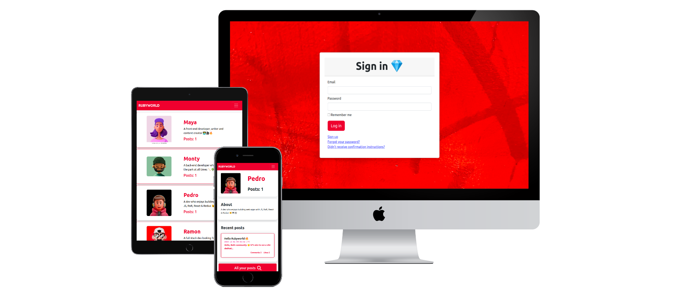

# Rubyworld ♦️🌎

>  A ruby on rails app that keeps track of all your recipes, ingredients, and inventory. Allows to save ingredients, keep track of what you have, create recipes, and generate a shopping list based on what you have and what you are missing from a recipe.



Check the [live demo](https://rubyworld.fly.dev/)

## Getting Started

This repository includes files with Ruby that can be used to test the created main classes from the app

Clone this link into your local device.

To run test make sure that rspec-rails and capybara libraries are installed in your project

To double check please run:
```
bundle install
```
This will install both gems if they were missing in your environment.

Run the server:
```
rails s
```

Open localhost:3000 port in your computer and go to /users to check all users
```
localhost:3000/users
```

Open localhost:3000 port in your computer and go to /users to check posts of a single user
```
localhost:3000/users/1
```

Open localhost:3000 port in your computer and go to /users to check posts, comments and likes of a user in greater detail
```
localhost:3000/users/1/posts
```

Open localhost:3000 port in your computer and go to /users to check an specific post
```
localhost:3000/users/1/posts/1
```

## Authors

👤 **Jose**

- GitHub: [@jr-cast](https://github.com/jr-cast)
- Twitter: [@josercastanos](https://twitter.com/josercastanos)
- LinkedIn: [@jr-cast](https://linkedin.com/in/jr-cast)

## 🤝 Contributing

Contributions, issues, and feature requests are welcome!

## Show your support

Give a ⭐️ if you like this project!

## Acknowledgments

- Hat tip to anyone whose code was used
- Inspiration
- Denin 

## 📝 License

This project is [MIT](./MIT.md) licensed.
